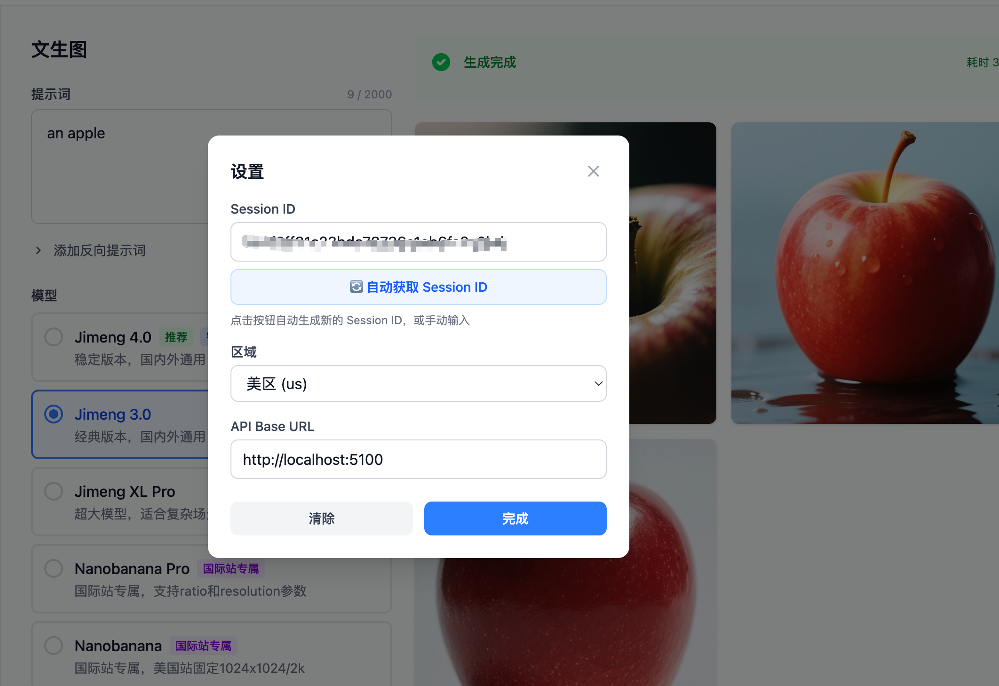
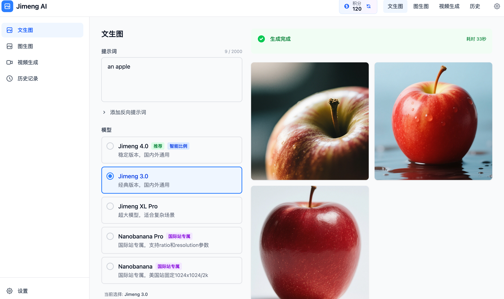

# Jimeng Web UI

🎨 **即梦 AI 的现代化 Web 界面** - 基于 Vue 3 + TypeScript + Tailwind CSS 构建的即梦 API 可视化操作界面。

[](https://vuejs.org/) [](https://www.typescriptlang.org/) [](https://vitejs.dev/) [](https://tailwindcss.com/)

## ✨ 特性

-  **文生图**: 通过文本描述生成高质量 AI 图像
-  **图生图**: 基于输入图片进行风格转换和内容合成
-  **视频生成**: 支持文生视频、图生视频和首尾帧视频生成
-  **多区域支持**: 支持国内站和国际站（美国/香港/日本/新加坡）
-  **自动获取 Session ID**: 使用 Playwright 自动化注册并获取 Sessionid（仅美区）
-  **丰富的可调参数**: 支持模型选择、比例调整、分辨率设置等
-  **响应式设计**: 完美适配桌面端和移动端
-  **智能比例**: 支持根据提示词自动推断最佳图像比例

## 📋 前置要求

### 必需依赖

- **jimeng-api**: 必须先启动 API 服务

#### Docker 部署（推荐）
- **Docker**: 20.10 或更高版本
- **Docker Compose**: V2

#### 手动部署
- **Node.js**: 20.19+ 或 22.12+（Vite 7 要求）
- **npm** 或 **yarn**: 包管理器

## 🚀 快速开始

### 方式一：Docker 一键部署（推荐 🌟）

使用 Docker Compose 同时部署 API 后端 + Web UI 前端，统一入口，无需单独配置。

```bash
# 在项目根目录执行
cd jimeng-api

# 一键构建并启动
docker compose up -d --build
```

启动成功后，访问 **`http://localhost:5200`** 即可使用 Web UI，API 也在同一地址下。

#### 架构说明

```
用户访问 http://host:5200
         │
    ┌────▼─────────────────────────┐
    │   jimeng-web-ui (Nginx)      │
    │                              │
    │  /v1/*   ─▶ API 反向代理       │
    │  /token/*─▶ API 反向代理       │
    │  /*      ─▶ Vue SPA 静态文件   │
    └───────┬──────────────────┘
            │ Docker 内部网络
    ┌───────▼──────────────────┐
    │   jimeng-api (Node.js)        │
    │   内部端口 :5100（不对外暴露）  │
    └──────────────────────────┘
```

- **统一入口**：只暴露一个端口（5200），前后端同源，零跨域问题
- **Nginx 反向代理**：`/v1/` 和 `/token/` 请求自动代理到后端 API
- **SSE 支持**：流式聊天接口已配置 `proxy_buffering off`
- **健康检查**：Web UI 会等待 API 健康后再启动

#### 常用 Docker 命令

```bash
# 查看服务状态
docker compose ps

# 查看日志
docker compose logs -f

# 停止服务
docker compose down

# 重新构建并启动
docker compose up -d --build
```

---

### 方式二：手动部署

#### 1. 启动 API 服务

首先，确保 jimeng-api 服务已经启动：

```bash
# 在项目根目录安装依赖
npm install

# 编译项目
npm run build

# 启动 API 服务
npm run dev
```

API 服务将在 `http://localhost:5100` 启动。

#### 2. 启动 Web UI

在新的终端窗口中：

```bash
# 进入 Web UI 目录
cd jimeng-web-ui

# 安装依赖
npm install

# 启动开发服务器
npm run dev
```

Web UI 将在 `http://localhost:9901` 启动。

### 3. 配置 Sessionid

#### 方式一：手动获取（推荐）

1. 打开浏览器访问 `http://localhost:9901`
2. 点击右上角的"设置"图标
3. 输入您的 Sessionid（从即梦或 Dreamina 官网获取）
4. 选择对应的区域（国内站/美国站/香港站/日本站/新加坡站）
5. 保存设置

#### 方式二：自动获取（仅美区 Dreamina）

使用 Playwright 自动化脚本自动注册美区账号并获取 Sessionid：

```bash
# 进入自动获取目录
cd playwright_getSession

# 安装依赖
npm install

# 运行自动获取脚本
node dreamina_registration.js
```

脚本执行完成后，Sessionid 将保存在 `playwrightTest/auth.json` 文件中。

> **⚠️ 重要说明**:
> - 此功能**仅支持美区 (US)**，其他区域（香港/日本/新加坡等）注册后无法获得免费积分
> - **必须通过美国代理节点**访问 `dreamina.capcut.com` 才能注册为美区账号
> - jimeng-api 服务端也需要配置能访问美国节点的代理，否则自动注册会失败
> - 需要安装 Playwright 浏览器驱动
> - 首次运行可能需要下载浏览器（约 300MB）
> - 自动获取过程需要 1-3 分钟

## 📖 功能说明

### 文生图 (Text-to-Image)

通过文本描述生成 AI 图像：

- **模型选择**: 支持 jimeng-4.5、jimeng-4.1、jimeng-4.0 等多个模型
- **比例设置**: 1:1、4:3、3:4、16:9、9:16、3:2、2:3、21:9
- **分辨率**: 1K、2K、4K（默认 2K）
- **智能比例**: 根据提示词自动推断最佳比例
- **负面提示词**: 指定不希望出现的内容
- **采样强度**: 控制生成的随机性（0.0-1.0）

### 图生图 (Image-to-Image)

基于输入图片进行创作：

- **本地上传**: 支持拖拽或点击上传本地图片
- **URL 输入**: 支持使用网络图片 URL
- **多图合成**: 支持 1-10 张图片的混合创作
- **风格转换**: 将照片转换为不同艺术风格
- **内容合成**: 融合多张图片的元素

### 视频生成 (Video Generation)

生成 AI 视频内容：

- **文生视频**: 纯文本描述生成视频
- **图生视频**: 使用单张图片作为首帧
- **首尾帧视频**: 使用两张图片分别作为首帧和尾帧
- **时长选择**: 5 秒或 10 秒
- **分辨率**: 720p 或 1080p
- **比例设置**: 1:1、4:3、3:4、16:9、9:16、21:9

## 🎨 界面预览

### 主要页面

- **文生图页面**: 简洁的文本输入和参数配置界面
- **图生图页面**: 支持拖拽上传的图片处理界面
- **视频生成页面**: 完整的视频生成参数配置
- **设置页面**: Sessionid 和区域配置

### 界面截图





## 🛠️ 技术栈

### 核心框架

- **Vue 3**: 使用 Composition API 和 `<script setup>` 语法
- **TypeScript**: 完整的类型支持
- **Vite**: 快速的开发构建工具
- **Vue Router 4**: 单页应用路由管理

### UI 和样式

- **Tailwind CSS 4**: 现代化的原子化 CSS 框架
- **Lucide Vue Next**: 精美的图标库
- **响应式设计**: 移动端和桌面端完美适配

### 状态管理和工具

- **Pinia**: Vue 3 官方推荐的状态管理库
- **@vueuse/core**: Vue 组合式 API 工具集
- **Axios**: HTTP 请求库

## 📁 项目结构

```
jimeng-web-ui/
├── src/
│   ├── assets/              # 静态资源
│   ├── components/          # 可复用组件
│   │   ├── common/         # 通用组件（按钮、输入框等）
│   │   ├── generation/     # 生成相关组件
│   │   └── layout/         # 布局组件
│   ├── composables/        # 组合式函数
│   ├── config/             # 配置文件
│   ├── layouts/            # 页面布局
│   ├── router/             # 路由配置
│   ├── services/           # API 服务层
│   ├── stores/             # Pinia 状态管理
│   ├── types/              # TypeScript 类型定义
│   ├── utils/              # 工具函数
│   ├── views/              # 页面组件
│   ├── App.vue             # 根组件
│   ├── main.ts             # 应用入口
│   └── style.css           # 全局样式
├── public/                 # 公共静态资源
├── index.html              # HTML 模板
├── vite.config.ts          # Vite 配置
├── tailwind.config.js      # Tailwind 配置
├── tsconfig.json           # TypeScript 配置
└── package.json            # 项目配置
```

## ⚙️ 配置说明

### API 地址配置

- **Docker 部署**：API 地址自动为当前页面 origin（如 `http://localhost:5200`），无需手动配置
- **手动部署**：默认为 `http://localhost:5100`，可在设置页面中修改

### 开发服务器端口

默认端口为 `9901`。如需修改，请编辑 `vite.config.ts`：

```typescript
export default defineConfig({
  server: {
    port: 9901  // 修改为您想要的端口
  }
})
```

## 🔑 自动获取 Session ID（仅美区）

### 功能说明

本项目提供了一个基于 Playwright 的自动化脚本，可以自动完成 Dreamina **美区**的账号注册流程并获取 Sessionid，无需手动操作。

> **⚠️ 为什么仅限美区？**
> 经过测试，只有美区 (US) 自动注册完成后可以立即获得免费积分，其他区域（香港/日本/新加坡）注册后无法获取免费积分。因此 Web UI 中仅在选择美区时才显示自动获取按钮。

### 工作原理

自动获取 Session ID 的过程分为以下几个步骤：

#### 1. 临时邮箱创建
- 使用 **Mail.tm** 免费临时邮箱服务
- 自动生成随机邮箱地址（格式：`user_xxxxx@domain.com`）
- 获取邮箱访问令牌用于后续接收验证邮件

#### 2. 浏览器自动化
- 使用 **Playwright** 启动 Chromium 浏览器
- 自动导航至 Dreamina 官网（`https://dreamina.capcut.com`）
- 模拟真实用户操作流程

#### 3. 账号注册流程
- 自动点击"Sign in" → "Continue with email" → "Sign up"
- 填写注册表单：
  - 邮箱：使用临时邮箱地址
  - 密码：自动生成强密码（格式：`Dreams123456!`）
- 提交注册请求

#### 4. 验证码处理
- 轮询临时邮箱，等待 Dreamina 发送验证邮件
- 使用正则表达式自动提取 6 位验证码
- 自动填写验证码并提交

#### 5. 完善账号信息
- 自动填写生日信息（默认：1995年1月15日）
- 选择用户角色（默认：Other）
- 点击"Continue to Dreamina"完成注册

#### 6. Session ID 提取
- 从浏览器 Cookies 中提取 `sessionid`
- 保存认证状态到 `playwrightTest/auth.json`
- 可直接用于 API 调用

### 技术实现

```javascript
// 核心技术栈
- Playwright: 浏览器自动化框架
- Axios: HTTP 请求库（用于邮箱 API）
- Mail.tm API: 临时邮箱服务

// 关键代码逻辑
1. 创建临时邮箱账号
2. 启动浏览器并导航到注册页面
3. 自动填写表单并提交
4. 轮询邮箱获取验证码
5. 完成验证和账号信息填写
6. 提取并保存 Session ID
```

### 注意事项

- ✅ **仅支持美区**: 此功能仅适用于 Dreamina 美区，其他区域注册后无免费积分
- 🌐 **美国代理必须**: 注册时**必须通过美国代理节点**访问 `dreamina.capcut.com`，否则无法注册为美区账号
- ⏱️ **执行时间**: 整个过程需要 1-3 分钟，请耐心等待
- 🌐 **网络要求**: 需要能够通过美国代理访问国际网络（Dreamina 和 Mail.tm）
- 💾 **浏览器下载**: 首次运行会自动下载 Chromium 浏览器（约 300MB）
- 🔄 **可重复执行**: 每次运行都会创建新的临时邮箱和账号
- 👀 **可视化模式**: 默认以非无头模式运行，可以看到浏览器操作过程
- 🔒 **安全性**: 临时邮箱和密码仅用于注册，不会泄露个人信息


### 故障排除

**问题 1: 验证码接收超时**
```
解决方案：
- 检查网络连接是否稳定
- 重新运行脚本（Mail.tm 偶尔会延迟）
- 手动访问 Mail.tm 确认服务是否正常
```

**问题 2: 页面元素定位失败**
```
解决方案：
- Dreamina 页面结构可能更新
- 查看浏览器窗口，确认当前停留在哪个步骤
- 根据实际页面调整选择器
```

**问题 3: Playwright 浏览器未安装**
```
解决方案：
# 手动安装 Playwright 浏览器
npx playwright install chromium
```

## 🐛 常见问题

### 1. 无法连接到 API 服务

**问题**: 页面显示"无法连接到服务器"

**解决方案**:
- 确保 jimeng-api 服务已启动（`npm run dev`）
- 检查 API 服务是否在 `http://localhost:5100` 运行
- 检查 `src/config/index.ts` 中的 API 地址配置

### 2. Sessionid 无效

**问题**: 提示"Sessionid 无效或已过期"

**解决方案**:
- 重新从即梦或 Dreamina 官网获取 Sessionid
- 确认选择了正确的区域（国内站/国际站）

### 3. 图片上传失败

**问题**: 图生图时上传图片失败

**解决方案**:
- 检查图片格式（支持 JPG、PNG、WebP）
- 确认图片大小不超过 10MB
- 尝试使用其他图片或压缩后再上传

### 4. 生成速度慢

**问题**: 图片或视频生成时间过长

**解决方案**:
- 图片生成通常需要 1-3 分钟
- 视频生成通常需要 3-15 分钟
- 4K 分辨率和复杂提示词会增加生成时间
- 检查网络连接是否稳定
- 使用jimeng3.0模型


## 📄 许可证

GPL v3 License - 详见 [LICENSE](../LICENSE) 文件

## ⚠️ 免责声明

本项目仅供学习和研究使用，请遵守相关服务条款和法律法规。使用本项目所产生的任何后果由使用者自行承担。


---

**享受使用 Jimeng Web UI 创作 AI 艺术作品！** 🎨✨
